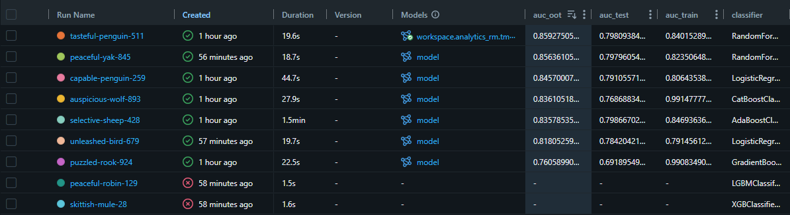

# Projeto de Fidelidade Téo Me Why


Modelo de classificação binária que estima a probabilidade de churn de clientes do programa de loyalty nos próximos 28 dias.

## Descrição do problema de negócio
O programa de loyalty (TMW) recompensa os clientes com pontos por interações (chat, presença, streak, etc.). Quando um cliente engajado para de interagir, a base perde receita e engajamento. O objetivo deste projeto é **antecipar esse abandono**: dado o comportamento histórico de cada cliente até uma data de referência, estimar a probabilidade de ele churnar nos **28 dias seguintes**, para que o time de negócio consiga priorizar ações de retenção.
Tipo de problema: classificação binária
Target: `flAtivacao = 1` _significa que o cliente fez uma transação na janlea de 28 dias de referência_
Data de referência da predição final: `2026-07-01` (coluna `dtRef` do arquivo final)

<br> 

## Sumário

1. [Descrição do problema](#-descrição-do-problema-de-negócio)
2. [Estrutura do repositório](#-estrutura-do-repositório)
3. [Dados utilizados](#-dados-utilizados)
4. [Metodologia / Pipeline](#-metodologia--pipeline)
5. [Variáveis mais importantes](#-variáveis-mais-importantes)
6. [Resultados e métricas](#-resultados-e-métricas)
7. [Como reproduzir](#-como-reproduzir)
8. [Top 50 clientes com maior probabilidade de churn](#-top-50-clientes-com-maior-probabilidade-de-churn)
9. [Repositório e citação](#-repositório-e-citação)
10. [Próximos passos](#-próximos-passos)
11. [Autores / contato](#-autores--contato)

## Estrutura do repositório

```text
ASN2026_tmw-loyalty-t05/
├── Aulas/                      # Materiais e referências das aulas
|   ├── Arquivos_Teo-Referencia/
|       └── ...
│   ├── 2026-08-19_Aula01.ipynb
│   ├── 2026-08-26_Aula02.ipynb
│   ├── 2026-09-02_Aula03.ipynb
│   ├── 2026-09-09_Aula04.ipynb
│   ├── 2026-09-10_Aula04_Homework.ipynb
│   ├── 2026-09-16_Aula05.ipynb
│   ├── 2026-09-23_Aula06.ipynb
│   └── 2026-09-30_Aula07.ipynb
├── Modelo/                     
│   ├── sql/
│   │   ├── fs_education.sql        # Feature store: cursos
│   │   └── fs_loyalty.sql          # Feature store: loyalty
│   ├── 1_Feature_Store.ipynb       # Criação das features
│   ├── 2_ABT_RM.ipynb              # Montagem da ABT (tabela analítica)
│   ├── 3_Train.ipynb               # Treino, validação e tuning (modelo registrado no catálogo)
│   ├── 4_Predict.ipynb             # Scoring e geração do top 50
│   └── output/
│       ├── df_importances.csv      # Importância das features do modelo final
│       ├── top_50_predictions.csv  # Top 50 clientes com maior probabilidade de churn 
|       └── img/     
├── requirements.txt            
└── README.md
```

> **Projeto desenvolvido no Databricks.** O repositório guarda código (notebooks e SQL) e os dois CSVs finais em `Modelo/output/`. Tabelas, modelo treinado e demais artefatos ficam no **catálogo** do Databricks (ver [Artefatos no catálogo](#-artefatos-no-catálogo-databricks)).

## Dados utilizados

| Item | Descrição |
|---|---|
| Fonte | [Loyalty System](https://www.kaggle.com/datasets/teocalvo/teomewhy-loyalty-system) e [Education Platform](https://www.kaggle.com/datasets/teocalvo/teomewhy-education-platform) |
| Período | 2025-01-01 até 2026-07-01 |
| Nº de linhas (treino) | 2154 |
| Nº de colunas (features) | 69 features no modelo |
| Granularidade | 1 linha por cliente (`IdCliente`) por data de referência (`dtRef`) |

### Dicionário resumido de variáveis

| Grupo | Variáveis | Descrição |
|---|---|---|
| Frequência / volume | `QtdeFrequencia`, `freqVida`, `QtdeTransacoes`, `qtdeProdutoDistintos` | Quantos dias o cliente interagiu, quantas transações fez e quantos produtos distintos usou |
| Recência / tempo de casa | `Recencia`, `diasPrimeiraTransacao`, `diasDesdeUltimoStreak` | Dias desde a última interação, desde a primeira transação e desde o último streak |
| Pontos | `QtdePontos`, `QtdePontosPositivos`, `SaldoPontos`, `zScore` | Pontos acumulados, saldo atual e posição relativa do cliente |
| Mix de origem | `pctTransacao_*`, `pctPontosAbs_*`, `flStreak` | Participação de cada tipo de transação (chat, presença, streak, ponei, streamElements, outros) |
| Sazonalidade | `ShareDomingo` … `ShareSabado`, `ShareSemana1` … `ShareSemana4` | Distribuição das interações por dia da semana e por semana do mês |
| Cursos / engajamento | `qtdCursosIniciados`, `qtdCursosFinalizados`, `avgTempoInicioUltimo`, `avgTempoInicioFim`, colunas de curso (`python_2025`, `github_2025`, `sql_2025`, …) | Participação em cursos e progresso neles |

## Artefatos no catálogo (Databricks)

Os artefatos não ficam no repositório. Eles ficam no catálogo do Databricks:

| Artefato | Onde está | Gerado por |
|---|---|---|
| Feature store (loyalty e cursos) | `workspace.analytics_rm.fs_loyalty` `workspace.analytics_rm.fs_loyalty` | `1_Feature_Store.ipynb` + `sql/*.sql` |
| ABT (tabela analítica de treino) | `workspace.analytics_rm.abt_ativacao` | `2_ABT_RM.ipynb` |
| Modelo treinado / experimento MLflow | `workspace.analytics_rm.Models.tmw_ativacao_t5` | `3_Train.ipynb` |
| Predições (todos os clientes) | `workspace.model_output.tmw_ativacao_t5_scores` | `4_Predict.ipynb` |

Os arquivos [`df_importances.csv`](./Modelo/output/df_importances.csv) e [`top_50_predictions.csv`](./Modelo/output/op_50_predictions.csv) são exportados para `Modelo/output/` para facilitar a consulta no GitHub.

## Metodologia / Pipeline

```text
EDA → Feature engineering → Treino → Validação → Tuning → Avaliação → Scoring final (top 50)
```

| Etapa | O que foi feito |
|---|---|
| EDA | [PREENCHER] |
| Feature engineering | Features de frequência, recência, pontos, mix de transações, sazonalidade (dia da semana / semana do mês) e cursos. [PREENCHER: detalhes, janelas de tempo] |
| Treino | [PREENCHER: modelos testados e modelo final] |
| Validação | [PREENCHER: ex.: out-of-time, validação cruzada] |
| Tuning | [PREENCHER] |
| Avaliação | [PREENCHER: métricas] |
| Desbalanceamento | [PREENCHER: ex.: `scale_pos_weight`, SMOTE, nada] |

## Variáveis mais importantes

Fonte: `Modelo/output/df_importances.csv`. O modelo tem 69 features; **38 têm importância > 0** e 31 têm importância zero. As 15 primeiras acumulam ~81% da importância total.

| # | Variável | Importância | Acumulado | Interpretação de negócio (confirmar) |
|---|---|---|---|---|
| 1 | `QtdeFrequencia` | 0,1392 | 13,9% | Dias em que o cliente interagiu na janela recente: principal sinal de engajamento |
| 2 | `freqVida` | 0,0980 | 23,7% | Frequência acumulada ao longo da vida: hábito consolidado |
| 3 | `Recencia` | 0,0980 | 33,5% | Há quantos dias o cliente interagiu pela última vez |
| 4 | `QtdeTransacoes` | 0,0712 | 40,6% | Volume de interações recentes |
| 5 | `ShareSemana1` | 0,0595 | 46,6% | Parcela das interações na 1ª semana do mês |
| 6 | `SaldoPontos` | 0,0563 | 52,2% | Pontos acumulados e ainda não usados |
| 7 | `QtdePontosPositivos` | 0,0502 | 57,2% | Pontos ganhos na janela |
| 8 | `diasDesdeUltimoStreak` | 0,0449 | 61,7% | Tempo desde a última sequência de dias consecutivos |
| 9 | `diasPrimeiraTransacao` | 0,0341 | 65,1% | Tempo de casa do cliente |
| 10 | `zScore` | 0,0296 | 68,1% | Posição do cliente em relação à base |
| 11 | `ShareSexta` | 0,0291 | 71,0% | Parcela das interações às sextas |
| 12 | `QtdePontos` | 0,0291 | 73,9% | Pontos líquidos na janela |
| 13 | `qtdeProdutoDistintos` | 0,0271 | 76,6% | Diversidade de produtos usados |
| 14 | `ShareQuinta` | 0,0237 | 79,0% | Parcela das interações às quintas |
| 15 | `ShareTerca` | 0,0232 | 81,3% | Parcela das interações às terças |

Leitura geral: o modelo se apoia principalmente em **frequência, recência e volume**; sazonalidade e mix de origem aparecem em seguida; variáveis de cursos têm peso próximo de zero.

## Resultados e métricas



**Matriz de confusão (modelo final, threshold [PREENCHER]):**

| | Previsto: não churn | Previsto: churn |
|---|---|---|
| Real: não churn | [PREENCHER] | [PREENCHER] |
| Real: churn | [PREENCHER] | [PREENCHER] |

**Curvas:** [PREENCHER: descrever a curva ROC (AUC e comportamento) e a curva Precision-Recall (precisão em diferentes níveis de recall)].

## Como reproduzir

O projeto roda no **Databricks**.

1. No workspace, crie uma **Git folder (Repos)** apontando para `https://github.com/RakellM/ASN2026_tmw-loyalty-t05.git`.
2. Instale as dependências extras, se houver: `%pip install -r requirements.txt` ([PREENCHER]).
3. Execute os notebooks de `Modelo/` na ordem:

| Ordem | Notebook | O que faz |
|---|---|---|
| 1 | `1_Feature_Store.ipynb` | Cria as features a partir dos `.sql` em `Modelo/sql/` |
| 2 | `2_ABT_RM.ipynb` | Monta a ABT de treino |
| 3 | `3_Train.ipynb` | Treina, valida, ajusta e registra o modelo no catálogo |
| 4 | `4_Predict.ipynb` | Gera as probabilidades e o `top_50_predictions.csv` |

## Top 50 clientes com maior probabilidade de churn

O arquivo final é [**top_50_predictions.csv**](./Modelo/output/top_50_predictions.csv), gerado pelo notebook `4_Predict.ipynb`.

| Item | Valor |
|---|---|
| Data de referência (`dtRef`) | 2026-07-01 |
| Nº de clientes | 50 (todos com `IdCliente` único) |
| Coluna de probabilidade | `Proba` |
| Faixa de `Proba` | 0,1688 a 0,3137 (mediana 0,2314) |
| Colunas | `dtRef`, `IdCliente`, 69 features do modelo e `Proba` (72 colunas no total) |

**Como é gerado**:
1. As features de todos os clientes são calculadas para a `dtRef`.
2. O modelo final gera `Proba = P(flAtivacao = 1)` para cada cliente (_predict_proba_, classe 1).
3. A probabilidade de churn é `1 − Proba`. Os clientes são ordenados por Proba do menor para o maior (equivale a ordenar a probabilidade de churn do maior para o menor).
4. Os 50 primeiros dessa lista são salvos em `top_50_predictions.csv`, por isso o arquivo está em ordem crescente de `Proba`.


## Repositório e citação

Repositório: <https://github.com/RakellM/ASN2026_tmw-loyalty-t05>

```text
[Raquel Marques]. ASN2026 – TMW Loyalty – Time 05: previsão de churn em 28 dias. 2026.
Disponível em: https://github.com/RakellM/ASN2026_tmw-loyalty-t05
```

## Próximos passos

- Calibrar as probabilidades
- Testar novos modelos e janelas de tempo
- Podar as 31 features com importância zero e reavaliar o desempenho
- Monitoramento em produção e teste A/B de ações de retenção

## 👥 Autores / contato

[Raquel Marques](https://github.com/RakellM)


